# Feature Dependency Graph

**Step 4 of Planning Phase**
**Date:** December 11, 2025 (Updated)
**Companion to:** 04_Dependency_Matrix.md

---

## 1. High-Level Category Flow

This diagram shows how feature categories depend on each other:

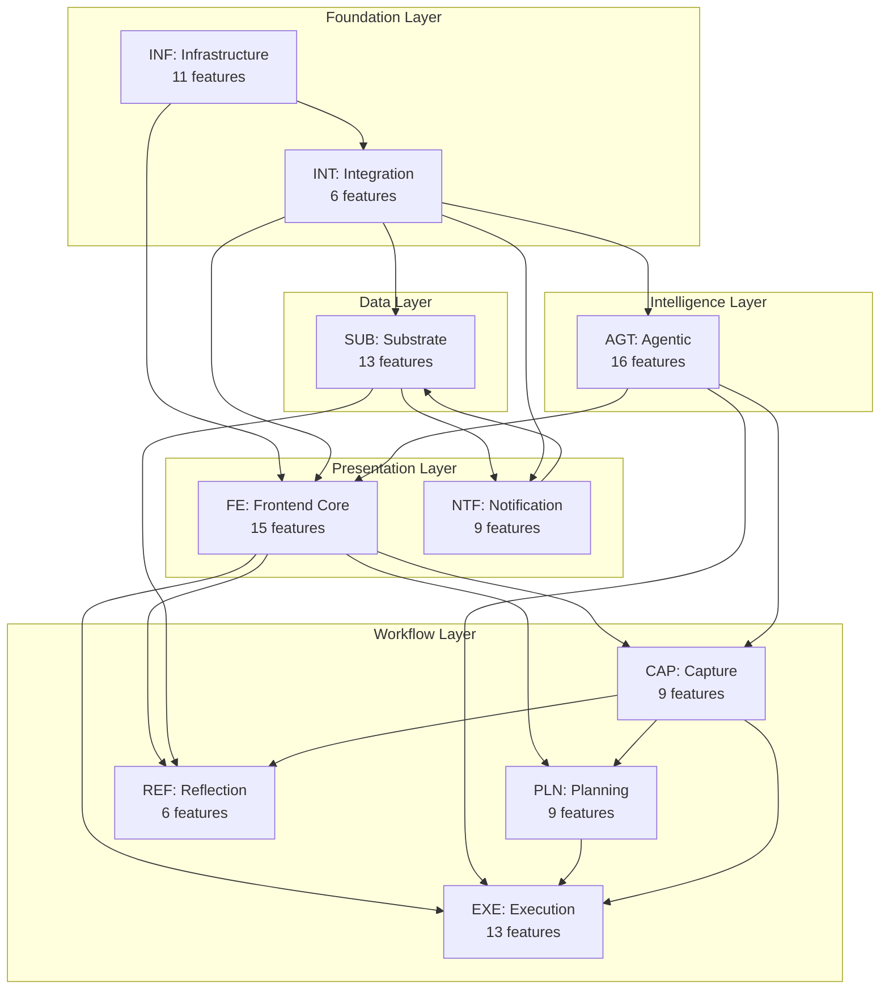
```mermaid
flowchart TB
    subgraph Foundation["Foundation Layer"]
        INF[INF: Infrastructure<br/>11 features]
        INT[INT: Integration<br/>6 features]
    end

    subgraph Data["Data Layer"]
        SUB[SUB: Substrate<br/>13 features]
    end

    subgraph Intelligence["Intelligence Layer"]
        AGT[AGT: Agentic<br/>16 features]
    end

    subgraph Presentation["Presentation Layer"]
        FE[FE: Frontend Core<br/>15 features]
        NTF[NTF: Notification<br/>9 features]
    end

    subgraph Workflows["Workflow Layer"]
        CAP[CAP: Capture<br/>9 features]
        PLN[PLN: Planning<br/>9 features]
        EXE[EXE: Execution<br/>13 features]
        REF[REF: Reflection<br/>6 features]
    end

    INF --> INT
    INT --> SUB
    INT --> AGT
    INF --> FE
    INT --> FE
    AGT --> FE
    SUB --> NTF
    INT --> NTF
    FE --> CAP
    AGT --> CAP
    FE --> PLN
    CAP --> PLN
    FE --> EXE
    AGT --> EXE
    PLN --> EXE
    CAP --> EXE
    FE --> REF
    SUB --> REF
    CAP --> REF
    NTF --> SUB
```

---

## 2. Critical Path - Foundation Features

These 12 features have no dependencies and can be built immediately:

```mermaid
flowchart LR
    subgraph "Foundation Features (No Dependencies)"
        INF1[INF-001<br/>Next.js Setup]
        INF2[INF-002<br/>FastAPI Setup]
        FE7[FE-007<br/>Avoidance Indicator]
        FE8[FE-008<br/>Timer Component]
        FE9[FE-009<br/>Loading States]
        FE10[FE-010<br/>Empty States]
        FE11[FE-011<br/>Offline Awareness]
        CAP2[CAP-002<br/>Chat Text Input]
        CAP6[CAP-006<br/>Correction Flow]
        EXE3[EXE-003<br/>Subtask Checklist]
        EXE11[EXE-011<br/>Avoidance Acknowledgment]
        PLN6[PLN-006<br/>Time Budget Display]
    end

    style INF1 fill:#2d5a27,color:#fff
    style INF2 fill:#2d5a27,color:#fff
    style FE7 fill:#1e4d6b,color:#fff
    style FE8 fill:#1e4d6b,color:#fff
    style FE9 fill:#1e4d6b,color:#fff
    style FE10 fill:#1e4d6b,color:#fff
    style FE11 fill:#1e4d6b,color:#fff
    style CAP2 fill:#5a3d7a,color:#fff
    style CAP6 fill:#5a3d7a,color:#fff
    style EXE3 fill:#8b4513,color:#fff
    style EXE11 fill:#8b4513,color:#fff
    style PLN6 fill:#4a5568,color:#fff
```

---

## 3. Most Depended Upon Features

These form the critical path - delays here impact many features:

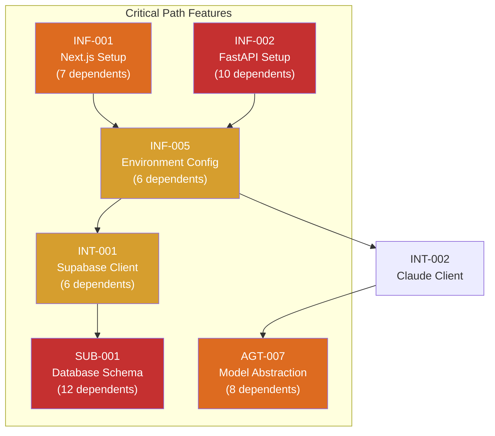
```mermaid
flowchart TB
    subgraph "Critical Path Features"
        INF2["INF-002<br/>FastAPI Setup<br/>(10 dependents)"]
        SUB1["SUB-001<br/>Database Schema<br/>(12 dependents)"]
        AGT7["AGT-007<br/>Model Abstraction<br/>(8 dependents)"]
        INF1["INF-001<br/>Next.js Setup<br/>(7 dependents)"]
        INT1["INT-001<br/>Supabase Client<br/>(6 dependents)"]
        INF5["INF-005<br/>Environment Config<br/>(6 dependents)"]
    end

    INF1 --> INF5
    INF2 --> INF5
    INF5 --> INT1
    INT1 --> SUB1
    INF5 --> INT2[INT-002<br/>Claude Client]
    INT2 --> AGT7

    style INF2 fill:#c53030,color:#fff
    style SUB1 fill:#c53030,color:#fff
    style AGT7 fill:#dd6b20,color:#fff
    style INF1 fill:#dd6b20,color:#fff
    style INT1 fill:#d69e2e,color:#fff
    style INF5 fill:#d69e2e,color:#fff
```

---

## 4. Cluster Diagrams

### Cluster 1: Core Infrastructure

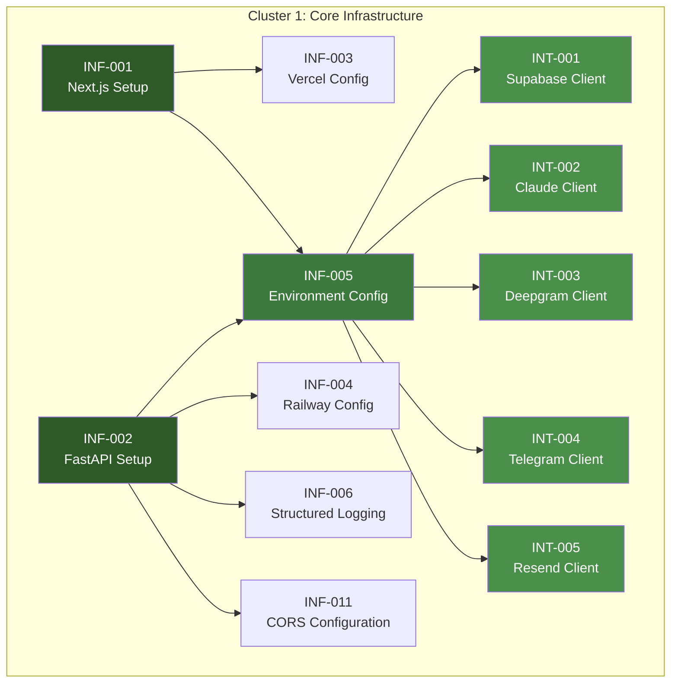
```mermaid
flowchart TB
    subgraph "Cluster 1: Core Infrastructure"
        INF1[INF-001<br/>Next.js Setup]
        INF2[INF-002<br/>FastAPI Setup]
        INF5[INF-005<br/>Environment Config]
        INF3[INF-003<br/>Vercel Config]
        INF4[INF-004<br/>Railway Config]
        INF6[INF-006<br/>Structured Logging]
        INF11[INF-011<br/>CORS Configuration]
        INT1[INT-001<br/>Supabase Client]
        INT2[INT-002<br/>Claude Client]
        INT3[INT-003<br/>Deepgram Client]
        INT4[INT-004<br/>Telegram Client]
        INT5[INT-005<br/>Resend Client]
    end

    INF1 --> INF3
    INF1 --> INF5
    INF2 --> INF4
    INF2 --> INF5
    INF2 --> INF6
    INF2 --> INF11
    INF5 --> INT1
    INF5 --> INT2
    INF5 --> INT3
    INF5 --> INT4
    INF5 --> INT5

    style INF1 fill:#2d5a27,color:#fff
    style INF2 fill:#2d5a27,color:#fff
    style INF5 fill:#3d7a3d,color:#fff
    style INT1 fill:#4a8f4a,color:#fff
    style INT2 fill:#4a8f4a,color:#fff
    style INT3 fill:#4a8f4a,color:#fff
    style INT4 fill:#4a8f4a,color:#fff
    style INT5 fill:#4a8f4a,color:#fff
```

### Cluster 2: Database & Authentication

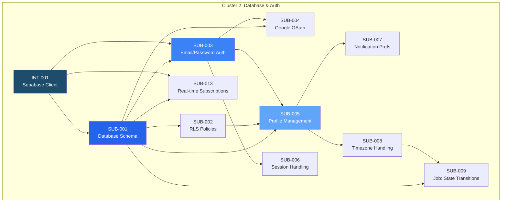
```mermaid
flowchart TB
    subgraph "Cluster 2: Database & Auth"
        INT1[INT-001<br/>Supabase Client]
        SUB1[SUB-001<br/>Database Schema]
        SUB2[SUB-002<br/>RLS Policies]
        SUB3[SUB-003<br/>Email/Password Auth]
        SUB4[SUB-004<br/>Google OAuth]
        SUB5[SUB-005<br/>Profile Management]
        SUB6[SUB-006<br/>Session Handling]
        SUB7[SUB-007<br/>Notification Prefs]
        SUB8[SUB-008<br/>Timezone Handling]
        SUB9[SUB-009<br/>Job: State Transitions]
        SUB13[SUB-013<br/>Real-time Subscriptions]
    end

    INT1 --> SUB1
    SUB1 --> SUB2
    SUB1 --> SUB3
    INT1 --> SUB3
    SUB1 --> SUB4
    SUB3 --> SUB4
    SUB1 --> SUB5
    SUB2 --> SUB5
    SUB3 --> SUB5
    SUB3 --> SUB6
    SUB5 --> SUB7
    SUB5 --> SUB8
    SUB1 --> SUB9
    SUB8 --> SUB9
    SUB1 --> SUB13
    INT1 --> SUB13

    style INT1 fill:#1e4d6b,color:#fff
    style SUB1 fill:#2563eb,color:#fff
    style SUB3 fill:#3b82f6,color:#fff
    style SUB5 fill:#60a5fa,color:#fff
```

### Cluster 3: AI/Agentic Layer

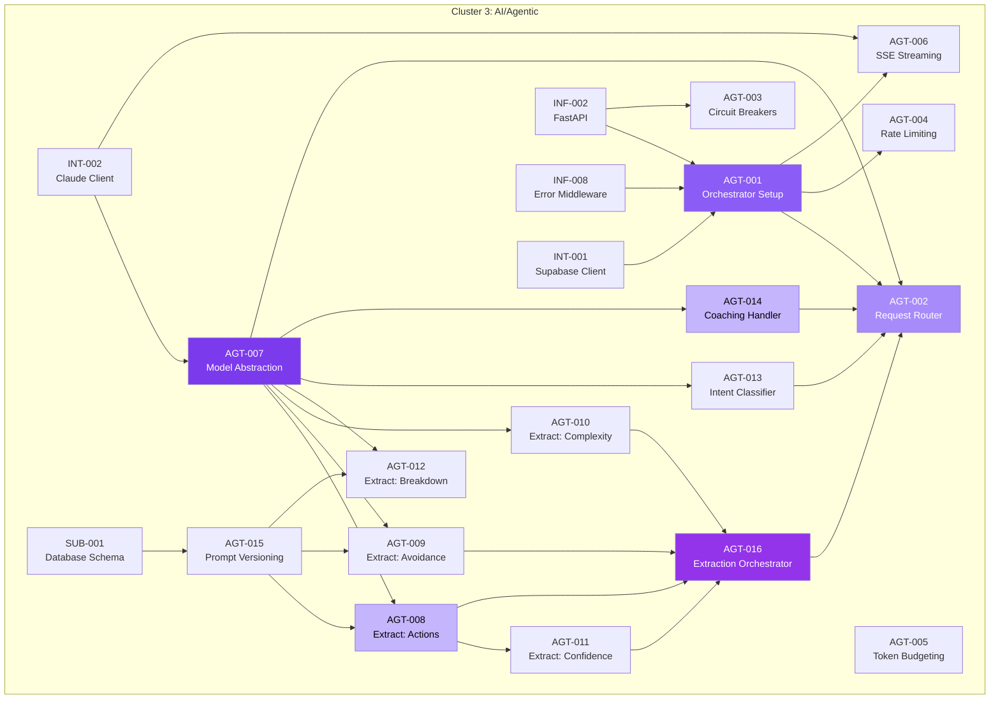
```mermaid
flowchart TB
    subgraph "Cluster 3: AI/Agentic"
        INT2[INT-002<br/>Claude Client]
        INF2[INF-002<br/>FastAPI]
        INF8[INF-008<br/>Error Middleware]
        INT1[INT-001<br/>Supabase Client]
        SUB1[SUB-001<br/>Database Schema]

        AGT7[AGT-007<br/>Model Abstraction]
        AGT1[AGT-001<br/>Orchestrator Setup]
        AGT2[AGT-002<br/>Request Router]
        AGT3[AGT-003<br/>Circuit Breakers]
        AGT4[AGT-004<br/>Rate Limiting]
        AGT5[AGT-005<br/>Token Budgeting]
        AGT6[AGT-006<br/>SSE Streaming]
        AGT15[AGT-015<br/>Prompt Versioning]

        AGT8[AGT-008<br/>Extract: Actions]
        AGT9[AGT-009<br/>Extract: Avoidance]
        AGT10[AGT-010<br/>Extract: Complexity]
        AGT11[AGT-011<br/>Extract: Confidence]
        AGT12[AGT-012<br/>Extract: Breakdown]
        AGT13[AGT-013<br/>Intent Classifier]
        AGT14[AGT-014<br/>Coaching Handler]
        AGT16[AGT-016<br/>Extraction Orchestrator]
    end

    INT2 --> AGT7
    SUB1 --> AGT15
    AGT7 --> AGT8
    AGT15 --> AGT8
    AGT7 --> AGT9
    AGT15 --> AGT9
    AGT7 --> AGT10
    AGT7 --> AGT12
    AGT15 --> AGT12
    AGT7 --> AGT13
    AGT7 --> AGT14
    AGT8 --> AGT11

    AGT8 --> AGT16
    AGT9 --> AGT16
    AGT10 --> AGT16
    AGT11 --> AGT16

    INF2 --> AGT1
    INF8 --> AGT1
    INT1 --> AGT1
    INF2 --> AGT3
    AGT1 --> AGT2
    AGT7 --> AGT2
    AGT13 --> AGT2
    AGT16 --> AGT2
    AGT14 --> AGT2
    AGT1 --> AGT4
    INT2 --> AGT6
    AGT1 --> AGT6

    style AGT7 fill:#7c3aed,color:#fff
    style AGT1 fill:#8b5cf6,color:#fff
    style AGT2 fill:#a78bfa,color:#fff
    style AGT8 fill:#c4b5fd,color:#000
    style AGT14 fill:#c4b5fd,color:#000
    style AGT16 fill:#9333ea,color:#fff
```

### Cluster 4: Frontend Foundation

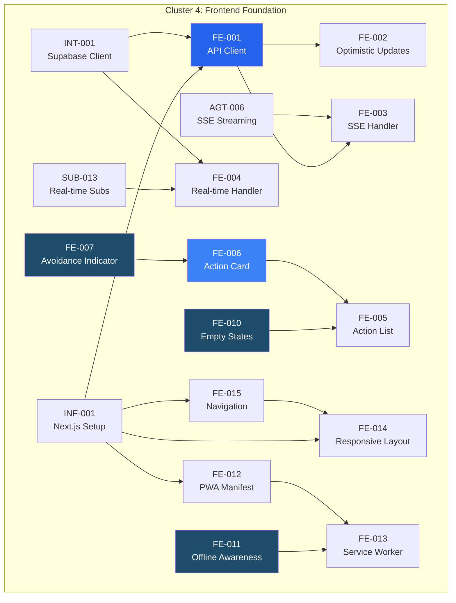
```mermaid
flowchart TB
    subgraph "Cluster 4: Frontend Foundation"
        INF1[INF-001<br/>Next.js Setup]
        INT1[INT-001<br/>Supabase Client]
        AGT6[AGT-006<br/>SSE Streaming]
        SUB13[SUB-013<br/>Real-time Subs]

        FE1[FE-001<br/>API Client]
        FE2[FE-002<br/>Optimistic Updates]
        FE3[FE-003<br/>SSE Handler]
        FE4[FE-004<br/>Real-time Handler]

        FE7[FE-007<br/>Avoidance Indicator]
        FE6[FE-006<br/>Action Card]
        FE5[FE-005<br/>Action List]
        FE10[FE-010<br/>Empty States]

        FE15[FE-015<br/>Navigation]
        FE14[FE-014<br/>Responsive Layout]
        FE12[FE-012<br/>PWA Manifest]
        FE11[FE-011<br/>Offline Awareness]
        FE13[FE-013<br/>Service Worker]
    end

    INT1 --> FE1
    INF1 --> FE1
    FE1 --> FE2
    AGT6 --> FE3
    FE1 --> FE3
    INT1 --> FE4
    SUB13 --> FE4

    FE7 --> FE6
    FE6 --> FE5
    FE10 --> FE5

    INF1 --> FE15
    FE15 --> FE14
    INF1 --> FE14
    INF1 --> FE12
    FE12 --> FE13
    FE11 --> FE13

    style FE7 fill:#1e4d6b,color:#fff
    style FE10 fill:#1e4d6b,color:#fff
    style FE11 fill:#1e4d6b,color:#fff
    style FE1 fill:#2563eb,color:#fff
    style FE6 fill:#3b82f6,color:#fff
```

### Cluster 5: Notification Layer

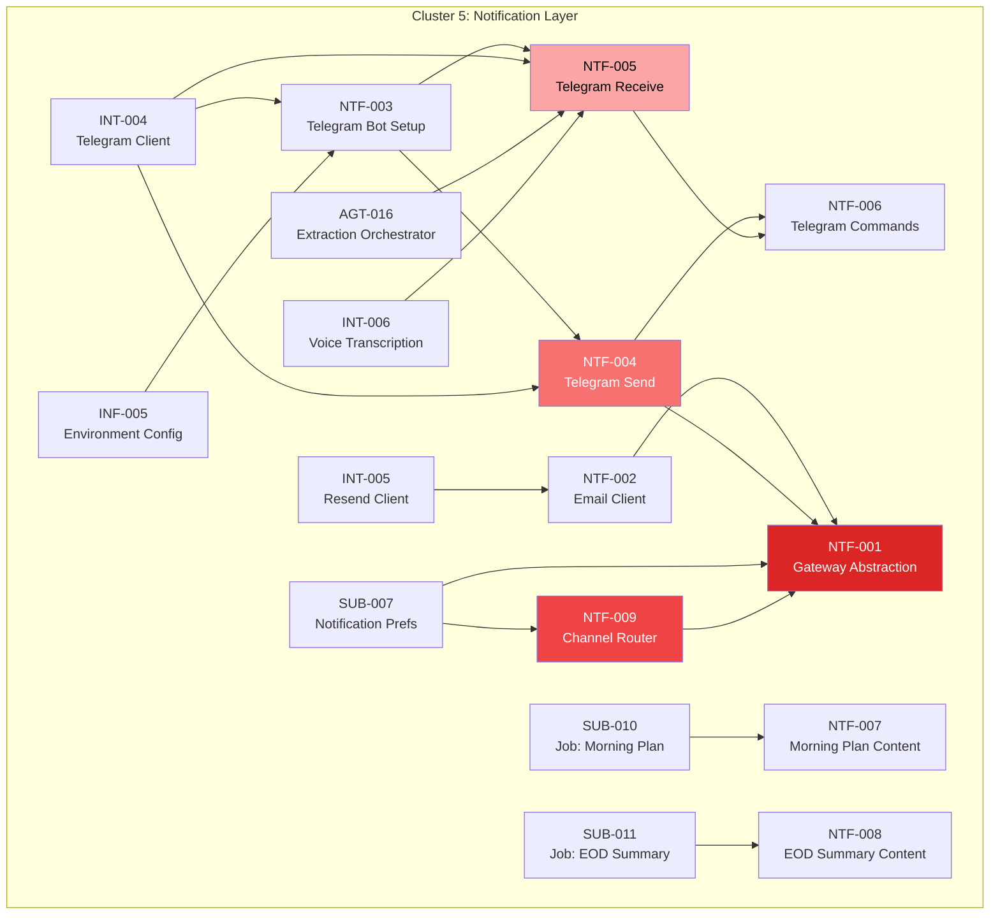
```mermaid
flowchart TB
    subgraph "Cluster 5: Notification Layer"
        INT4[INT-004<br/>Telegram Client]
        INT5[INT-005<br/>Resend Client]
        INT6[INT-006<br/>Voice Transcription]
        INF5[INF-005<br/>Environment Config]
        SUB7[SUB-007<br/>Notification Prefs]
        SUB10[SUB-010<br/>Job: Morning Plan]
        SUB11[SUB-011<br/>Job: EOD Summary]
        AGT16[AGT-016<br/>Extraction Orchestrator]

        NTF2[NTF-002<br/>Email Client]
        NTF3[NTF-003<br/>Telegram Bot Setup]
        NTF4[NTF-004<br/>Telegram Send]
        NTF5[NTF-005<br/>Telegram Receive]
        NTF6[NTF-006<br/>Telegram Commands]
        NTF1[NTF-001<br/>Gateway Abstraction]
        NTF9[NTF-009<br/>Channel Router]
        NTF7[NTF-007<br/>Morning Plan Content]
        NTF8[NTF-008<br/>EOD Summary Content]
    end

    INT5 --> NTF2
    INT4 --> NTF3
    INF5 --> NTF3
    NTF3 --> NTF4
    INT4 --> NTF4
    NTF3 --> NTF5
    INT4 --> NTF5
    AGT16 --> NTF5
    INT6 --> NTF5
    NTF4 --> NTF6
    NTF5 --> NTF6

    SUB7 --> NTF9
    NTF2 --> NTF1
    NTF4 --> NTF1
    SUB7 --> NTF1
    NTF9 --> NTF1

    SUB10 --> NTF7
    SUB11 --> NTF8

    style NTF1 fill:#dc2626,color:#fff
    style NTF9 fill:#ef4444,color:#fff
    style NTF4 fill:#f87171,color:#fff
    style NTF5 fill:#fca5a5,color:#000
```

### Cluster 6: User Workflow Features

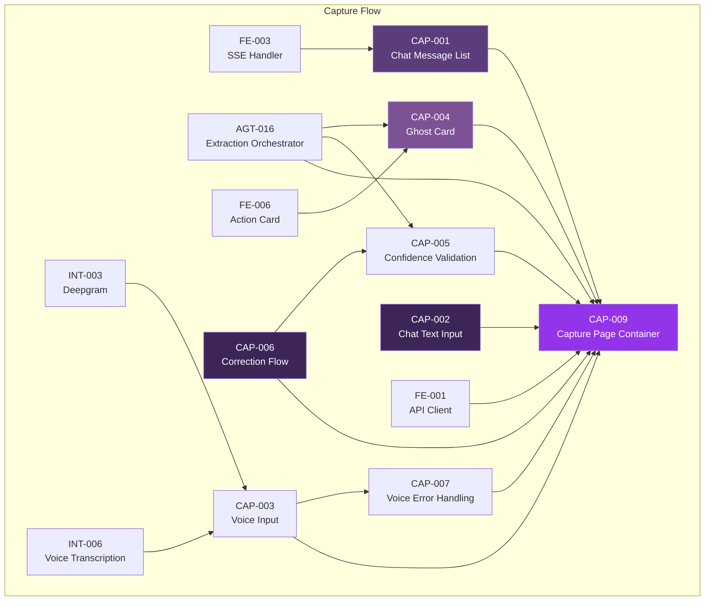
```mermaid
flowchart TB
    subgraph "Capture Flow"
        FE3[FE-003<br/>SSE Handler]
        FE1[FE-001<br/>API Client]
        AGT16[AGT-016<br/>Extraction Orchestrator]
        FE6[FE-006<br/>Action Card]
        CAP6[CAP-006<br/>Correction Flow]
        INT3[INT-003<br/>Deepgram]
        INT6[INT-006<br/>Voice Transcription]

        CAP1[CAP-001<br/>Chat Message List]
        CAP2[CAP-002<br/>Chat Text Input]
        CAP3[CAP-003<br/>Voice Input]
        CAP4[CAP-004<br/>Ghost Card]
        CAP5[CAP-005<br/>Confidence Validation]
        CAP7[CAP-007<br/>Voice Error Handling]
        CAP9[CAP-009<br/>Capture Page Container]
    end

    FE3 --> CAP1
    AGT16 --> CAP4
    FE6 --> CAP4
    AGT16 --> CAP5
    CAP6 --> CAP5
    INT3 --> CAP3
    INT6 --> CAP3
    CAP3 --> CAP7

    CAP1 --> CAP9
    CAP2 --> CAP9
    CAP3 --> CAP9
    CAP4 --> CAP9
    CAP5 --> CAP9
    CAP6 --> CAP9
    CAP7 --> CAP9
    FE1 --> CAP9
    AGT16 --> CAP9

    style CAP1 fill:#5a3d7a,color:#fff
    style CAP4 fill:#7c5295,color:#fff
    style CAP2 fill:#3d2657,color:#fff
    style CAP6 fill:#3d2657,color:#fff
    style CAP9 fill:#9333ea,color:#fff
```

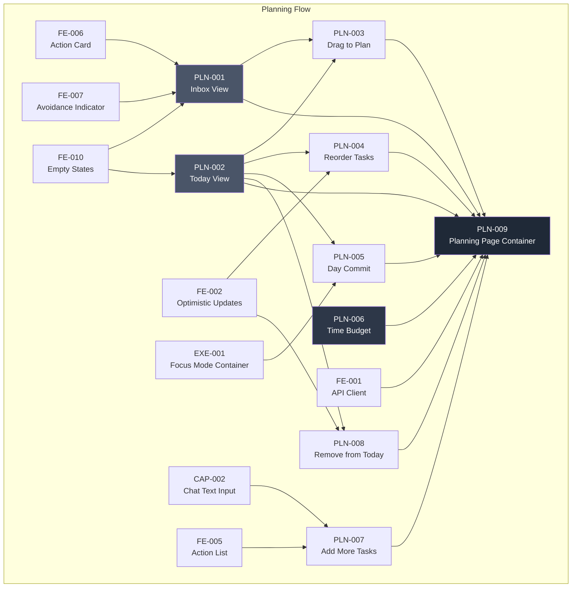
```mermaid
flowchart TB
    subgraph "Planning Flow"
        FE6[FE-006<br/>Action Card]
        FE7[FE-007<br/>Avoidance Indicator]
        FE10[FE-010<br/>Empty States]
        FE2[FE-002<br/>Optimistic Updates]
        FE5[FE-005<br/>Action List]
        FE1[FE-001<br/>API Client]
        CAP2[CAP-002<br/>Chat Text Input]
        EXE1[EXE-001<br/>Focus Mode Container]

        PLN1[PLN-001<br/>Inbox View]
        PLN2[PLN-002<br/>Today View]
        PLN3[PLN-003<br/>Drag to Plan]
        PLN4[PLN-004<br/>Reorder Tasks]
        PLN5[PLN-005<br/>Day Commit]
        PLN6[PLN-006<br/>Time Budget]
        PLN7[PLN-007<br/>Add More Tasks]
        PLN8[PLN-008<br/>Remove from Today]
        PLN9[PLN-009<br/>Planning Page Container]
    end

    FE6 --> PLN1
    FE7 --> PLN1
    FE10 --> PLN1
    FE10 --> PLN2
    PLN1 --> PLN3
    PLN2 --> PLN3
    PLN2 --> PLN4
    FE2 --> PLN4
    PLN2 --> PLN5
    EXE1 --> PLN5
    CAP2 --> PLN7
    FE5 --> PLN7
    PLN2 --> PLN8
    FE2 --> PLN8

    PLN1 --> PLN9
    PLN2 --> PLN9
    PLN3 --> PLN9
    PLN4 --> PLN9
    PLN5 --> PLN9
    PLN6 --> PLN9
    PLN7 --> PLN9
    PLN8 --> PLN9
    FE1 --> PLN9

    style PLN1 fill:#4a5568,color:#fff
    style PLN2 fill:#4a5568,color:#fff
    style PLN6 fill:#2d3748,color:#fff
    style PLN9 fill:#1f2937,color:#fff
```

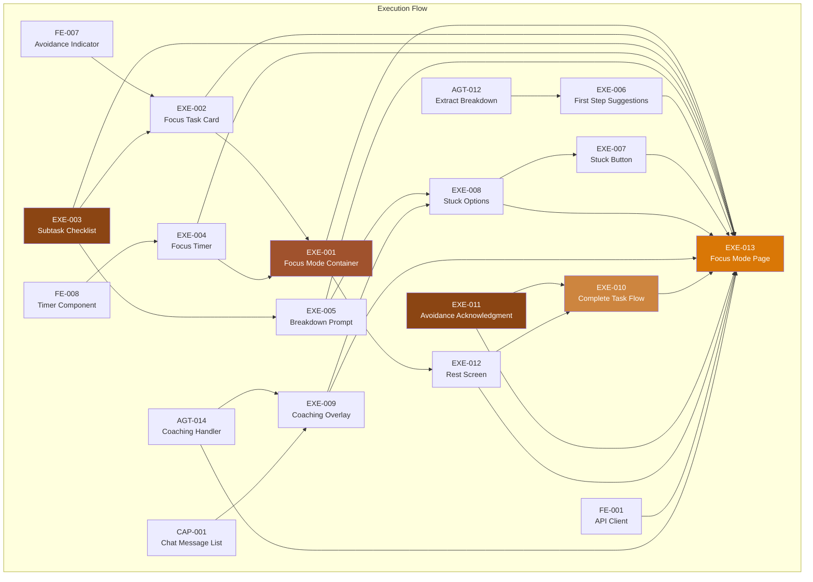
```mermaid
flowchart TB
    subgraph "Execution Flow"
        FE7[FE-007<br/>Avoidance Indicator]
        FE8[FE-008<br/>Timer Component]
        FE1[FE-001<br/>API Client]
        AGT12[AGT-012<br/>Extract Breakdown]
        AGT14[AGT-014<br/>Coaching Handler]
        CAP1[CAP-001<br/>Chat Message List]

        EXE3[EXE-003<br/>Subtask Checklist]
        EXE4[EXE-004<br/>Focus Timer]
        EXE11[EXE-011<br/>Avoidance Acknowledgment]
        EXE2[EXE-002<br/>Focus Task Card]
        EXE1[EXE-001<br/>Focus Mode Container]
        EXE5[EXE-005<br/>Breakdown Prompt]
        EXE6[EXE-006<br/>First Step Suggestions]
        EXE7[EXE-007<br/>Stuck Button]
        EXE8[EXE-008<br/>Stuck Options]
        EXE9[EXE-009<br/>Coaching Overlay]
        EXE12[EXE-012<br/>Rest Screen]
        EXE10[EXE-010<br/>Complete Task Flow]
        EXE13[EXE-013<br/>Focus Mode Page]
    end

    FE7 --> EXE2
    EXE3 --> EXE2
    EXE2 --> EXE1
    FE8 --> EXE4
    EXE4 --> EXE1

    EXE3 --> EXE5
    AGT12 --> EXE6

    EXE8 --> EXE7
    EXE5 --> EXE8
    EXE9 --> EXE8
    AGT14 --> EXE9
    CAP1 --> EXE9

    EXE1 --> EXE12
    EXE11 --> EXE10
    EXE12 --> EXE10

    EXE1 --> EXE13
    EXE2 --> EXE13
    EXE3 --> EXE13
    EXE4 --> EXE13
    EXE5 --> EXE13
    EXE6 --> EXE13
    EXE7 --> EXE13
    EXE8 --> EXE13
    EXE9 --> EXE13
    EXE10 --> EXE13
    EXE11 --> EXE13
    EXE12 --> EXE13
    FE1 --> EXE13
    AGT14 --> EXE13

    style EXE3 fill:#8b4513,color:#fff
    style EXE11 fill:#8b4513,color:#fff
    style EXE1 fill:#a0522d,color:#fff
    style EXE10 fill:#cd853f,color:#fff
    style EXE13 fill:#d97706,color:#fff
```

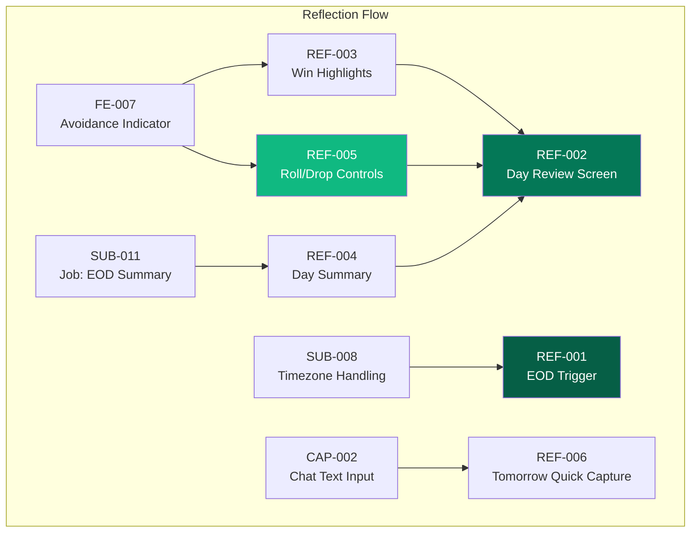
```mermaid
flowchart TB
    subgraph "Reflection Flow"
        FE7[FE-007<br/>Avoidance Indicator]
        SUB8[SUB-008<br/>Timezone Handling]
        SUB11[SUB-011<br/>Job: EOD Summary]
        CAP2[CAP-002<br/>Chat Text Input]

        REF3[REF-003<br/>Win Highlights]
        REF4[REF-004<br/>Day Summary]
        REF5[REF-005<br/>Roll/Drop Controls]
        REF2[REF-002<br/>Day Review Screen]
        REF1[REF-001<br/>EOD Trigger]
        REF6[REF-006<br/>Tomorrow Quick Capture]
    end

    FE7 --> REF3
    SUB11 --> REF4
    FE7 --> REF5
    REF3 --> REF2
    REF5 --> REF2
    REF4 --> REF2
    SUB8 --> REF1
    CAP2 --> REF6

    style REF1 fill:#065f46,color:#fff
    style REF2 fill:#047857,color:#fff
    style REF5 fill:#10b981,color:#fff
```

---

## 5. Build Order Overview

Based on the dependency analysis, the recommended build order is:

```mermaid
flowchart LR
    subgraph Phase1["Phase 1: Foundation (12 features)"]
        P1A[INF-001, INF-002]
        P1B[FE-007..FE-011]
        P1C[CAP-002, CAP-006]
        P1D[EXE-003, EXE-011]
        P1E[PLN-006]
    end

    subgraph Phase2["Phase 2: Core Services"]
        P2A[INF-003..INF-006]
        P2B[INT-001..INT-006]
    end

    subgraph Phase3["Phase 3: Data Layer"]
        P3A[SUB-001..SUB-006]
        P3B[SUB-007..SUB-009]
        P3C[SUB-013]
    end

    subgraph Phase4["Phase 4: AI Layer"]
        P4A[AGT-001, AGT-003, AGT-007]
        P4B[AGT-004..AGT-006, AGT-015]
        P4C[AGT-008..AGT-014]
        P4D[AGT-016, AGT-002]
    end

    subgraph Phase5["Phase 5: Notification"]
        P5A[NTF-002..NTF-004]
        P5B[NTF-009]
        P5C[NTF-005, NTF-006]
        P5D[NTF-001]
    end

    subgraph Phase6["Phase 6: Frontend"]
        P6A[FE-001..FE-004]
        P6B[FE-005, FE-006]
        P6C[FE-012..FE-015]
    end

    subgraph Phase7["Phase 7: Workflows"]
        P7A[CAP-001..CAP-008]
        P7B[PLN-001..PLN-008]
        P7C[EXE-001..EXE-012]
        P7D[REF-001..REF-006]
    end

    subgraph Phase8["Phase 8: Page Orchestrators & Jobs"]
        P8A[CAP-009, PLN-009, EXE-013]
        P8B[SUB-010..SUB-012]
        P8C[NTF-007, NTF-008]
        P8D[INF-007..INF-011]
    end

    Phase1 --> Phase2 --> Phase3 --> Phase4
    Phase4 --> Phase5
    Phase3 --> Phase6
    Phase5 --> Phase7
    Phase6 --> Phase7
    Phase4 --> Phase7
    Phase7 --> Phase8
```

---

## 6. Circular Dependency Resolutions (Visual)

Per the framework's binary test, weak links have been **removed from the matrix**. Only strong dependencies remain.

### PLN: Acyclic After Resolution

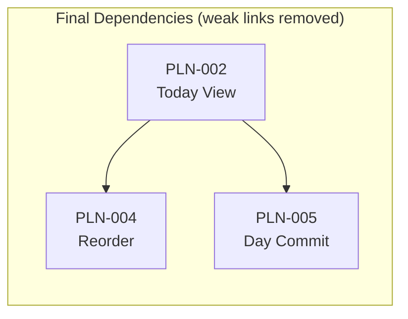
```mermaid
flowchart LR
    subgraph "Final Dependencies (weak links removed)"
        PLN2[PLN-002<br/>Today View]
        PLN4[PLN-004<br/>Reorder]
        PLN5[PLN-005<br/>Day Commit]

        PLN2 --> PLN4
        PLN2 --> PLN5
    end
```

Build order: PLN-002 first, then PLN-004 and PLN-005 can build in parallel.

### EXE: Acyclic After Resolution

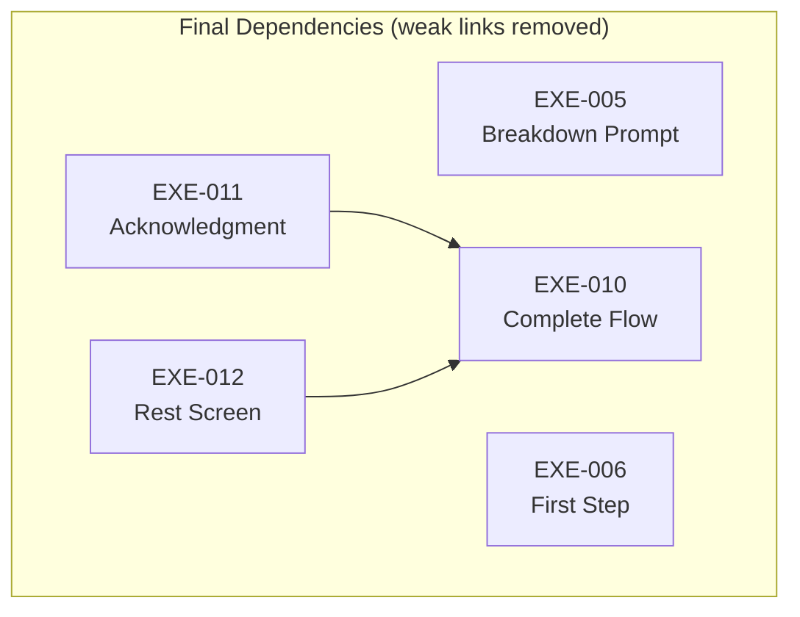
```mermaid
flowchart TB
    subgraph "Final Dependencies (weak links removed)"
        EXE5[EXE-005<br/>Breakdown Prompt]
        EXE6[EXE-006<br/>First Step]
        EXE11[EXE-011<br/>Acknowledgment]
        EXE12[EXE-012<br/>Rest Screen]
        EXE10[EXE-010<br/>Complete Flow]

        EXE11 --> EXE10
        EXE12 --> EXE10
    end
```

- EXE-005 and EXE-006: No mutual dependency, build independently
- EXE-011: Foundation feature (no dependencies)
- EXE-010 depends on EXE-011 and EXE-012

### REF: Acyclic After Resolution

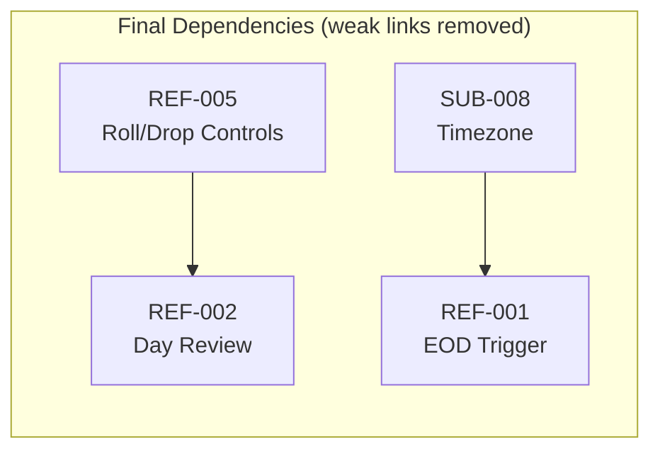
```mermaid
flowchart LR
    subgraph "Final Dependencies (weak links removed)"
        REF5[REF-005<br/>Roll/Drop Controls]
        REF2[REF-002<br/>Day Review]
        REF1[REF-001<br/>EOD Trigger]
        SUB8[SUB-008<br/>Timezone]

        REF5 --> REF2
        SUB8 --> REF1
    end
```

Build order: REF-005 first, then REF-002. REF-001 depends only on SUB-008 (independent of REF-002).

### NTF: Acyclic After Resolution

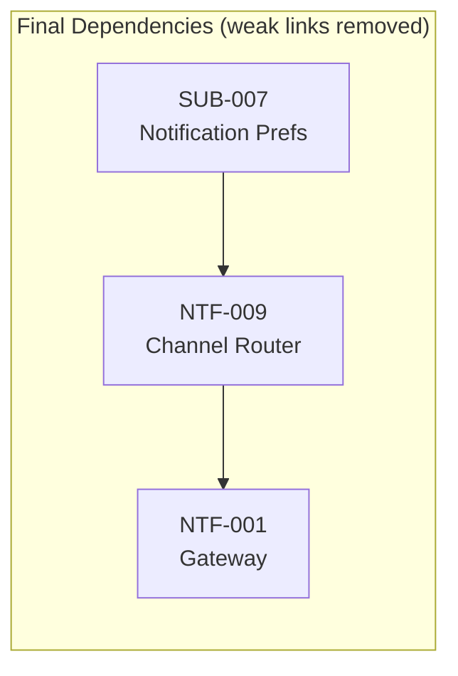
```mermaid
flowchart LR
    subgraph "Final Dependencies (weak links removed)"
        SUB7[SUB-007<br/>Notification Prefs]
        NTF9[NTF-009<br/>Channel Router]
        NTF1[NTF-001<br/>Gateway]

        SUB7 --> NTF9
        NTF9 --> NTF1
    end
```

- NTF-009 (Channel Router): Depends only on SUB-007, NOT NTF-001
- NTF-001 (Gateway): Now depends on NTF-009 (one-way dependency)
- Build order: NTF-009 first, then NTF-001

---

## 7. Cross-Category Dependency Summary

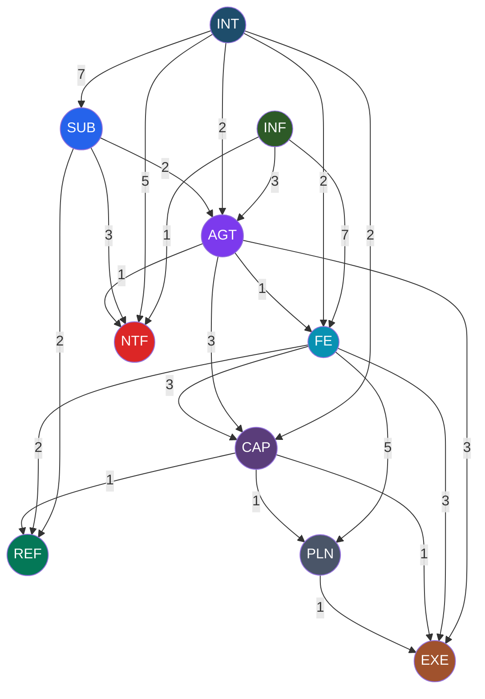
```mermaid
flowchart TB
    INF((INF)) -->|7| FE((FE))
    INF -->|3| AGT((AGT))
    INF -->|1| NTF((NTF))

    INT((INT)) -->|7| SUB((SUB))
    INT -->|2| AGT
    INT -->|2| FE
    INT -->|5| NTF
    INT -->|2| CAP((CAP))

    SUB -->|3| NTF
    SUB -->|2| REF((REF))
    SUB -->|2| AGT

    AGT -->|1| FE
    AGT -->|3| CAP
    AGT -->|3| EXE((EXE))
    AGT -->|1| NTF

    FE -->|5| PLN((PLN))
    FE -->|3| EXE
    FE -->|2| REF
    FE -->|3| CAP

    CAP -->|1| PLN
    CAP -->|1| EXE
    CAP -->|1| REF

    PLN -->|1| EXE

    style INF fill:#2d5a27,color:#fff
    style INT fill:#1e4d6b,color:#fff
    style SUB fill:#2563eb,color:#fff
    style AGT fill:#7c3aed,color:#fff
    style FE fill:#0891b2,color:#fff
    style NTF fill:#dc2626,color:#fff
    style CAP fill:#5a3d7a,color:#fff
    style PLN fill:#4a5568,color:#fff
    style EXE fill:#a0522d,color:#fff
    style REF fill:#047857,color:#fff
```

---

*Companion document: See 04_Dependency_Matrix.md for detailed dependency tables and statistics.*
